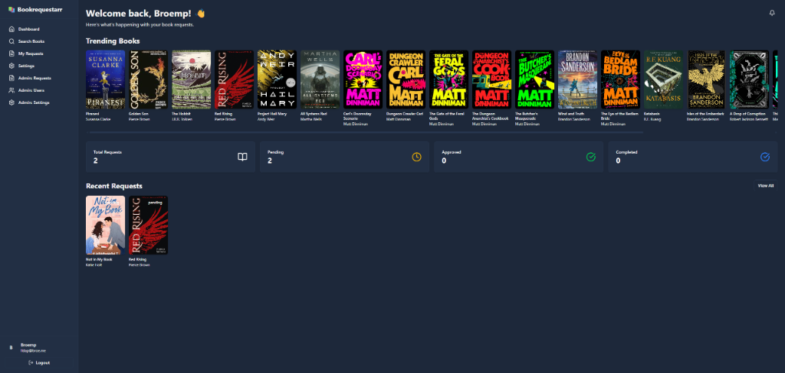
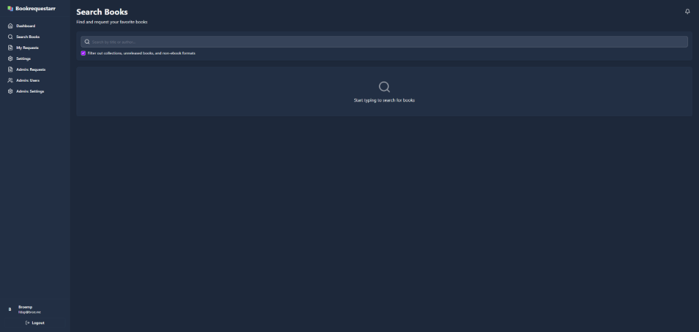
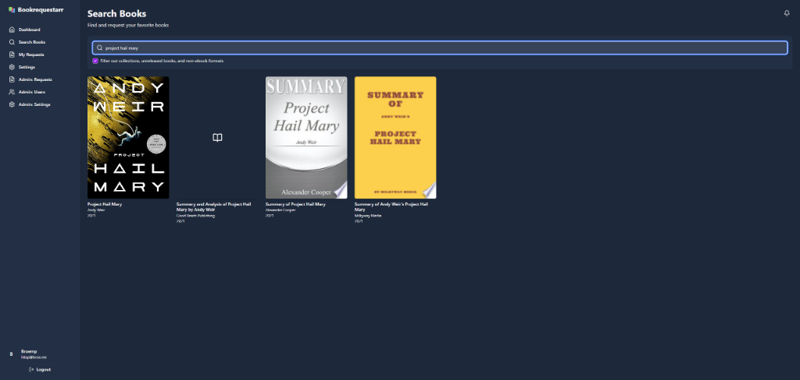
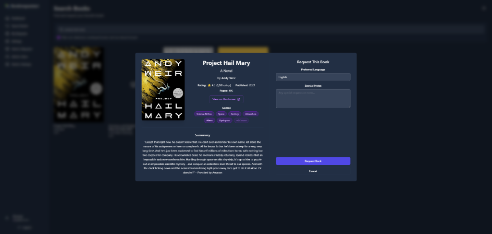
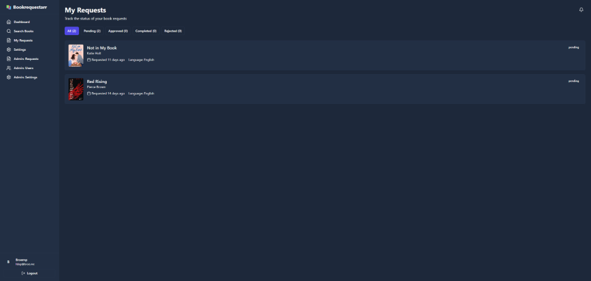
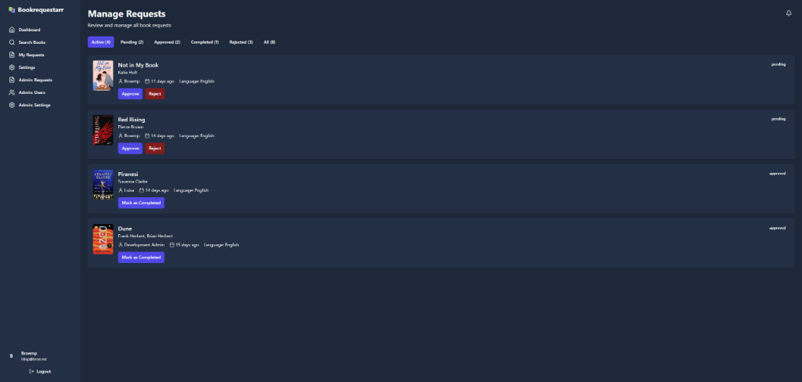
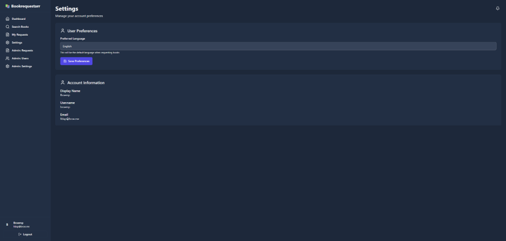

# 📚 Bookrequestarr

> **⚠️ Disclaimer**: This project was heavily vibe-coded with Cursor AI. I make no promises regarding completeness, security, or stability. Use at your own risk!

A modern, self-hosted web application for managing book requests. Similar to Overseerr for movies and TV shows, Bookrequestarr allows users to search for and request books, while administrators can manage these requests efficiently.

## ✨ Features

- 🔐 **OIDC Authentication** - Secure login with any OpenID Connect provider (Keycloak, Authentik, Authelia, etc.)
- 🔍 **Book Search** - Search for books using the Hardcover API with rich metadata
- 📖 **Request Management** - Users can request books with language preferences and special notes
- 👥 **User Management** - Admin panel for managing users and permissions
- 📊 **Dashboard** - Overview of requests, statistics, and new releases
- 🔔 **Notifications** - Discord and Telegram notifications for new requests
- 🎨 **Modern UI** - Clean, dark theme with responsive design
- 🐳 **Docker Ready** - Easy deployment with Docker and Docker Compose
- 🔄 **Reverse Proxy Support** - Works seamlessly behind Traefik, Nginx, or Caddy
- ⚡ **API Caching** - Smart caching system to reduce API calls and improve performance

## 📸 Screenshots

> **Note**: Screenshots are captured and available in the repository. The following images showcase the main features of Bookrequestarr.

### Dashboard


*Overview of your book requests, trending books, and statistics at a glance. The dashboard shows popular books from Hardcover's trending list and provides quick stats on your request status.*

### Search Books


*Search for books with a clean, responsive interface. The search page includes filters to exclude collections, unreleased books, and non-ebook formats.*



*Browse search results with beautiful cover images and metadata. Each book displays its title, author, and publication year.*

### Book Details


*View detailed book information including summary, genres, ratings, and request options. The modal provides all the information you need to make an informed request.*

### My Requests


*Track all your book requests and their current status. Filter by status (pending, approved, completed, rejected) to easily manage your requests.*

### Admin Panel


*Manage all user requests with approve, reject, and complete actions. Admins can see who requested each book and when, with quick action buttons for workflow management.*

### Settings


*Manage your account preferences including preferred language for book requests. View your account information synced from your OIDC provider.*

## 🚀 Quick Start

### Prerequisites

- Docker and Docker Compose (recommended)
- OR Node.js 20+ for local development
- An OIDC provider (Keycloak, Authentik, Authelia, etc.)
- A Hardcover API key ([get one here](https://hardcover.app/settings/api))

### Docker Deployment (Recommended)

#### Option 1: Using Pre-built Images (Easiest)

Pull the latest image from GitHub Container Registry:

```bash
docker pull ghcr.io/broemp/bookrequestarr:latest
```

Then use it in your `docker-compose.yml` or run directly:

```bash
docker run -d \
  --name bookrequestarr \
  -p 3000:3000 \
  -v ./data:/app/data \
  -e DATABASE_URL=/app/data/bookrequestarr.db \
  -e HARDCOVER_API_KEY=your_api_key \
  -e OIDC_ISSUER=https://your-oidc-provider.com \
  -e OIDC_CLIENT_ID=your_client_id \
  -e OIDC_CLIENT_SECRET=your_client_secret \
  -e OIDC_REDIRECT_URI=http://localhost:3000/api/auth/callback \
  -e JWT_SECRET=your_secure_random_string \
  -e PUBLIC_APP_URL=http://localhost:3000 \
  ghcr.io/broemp/bookrequestarr:latest
```

#### Option 2: Build from Source

1. **Clone the repository**

   ```bash
   git clone https://github.com/broemp/bookrequestarr.git
   cd bookrequestarr
   ```

2. **Create environment file**

   ```bash
   cp .env.example .env
   # Edit .env with your configuration
   ```

3. **Start the application**

   ```bash
   docker compose up -d
   ```

4. **Access the application**
   
   Navigate to `http://localhost:3000`

### Local Development

1. **Install dependencies**

   ```bash
   npm install
   ```

2. **Configure environment**

   ```bash
   cp .env.example .env
   # Edit .env with your configuration
   ```

3. **Start development server**

   ```bash
   npm run dev
   ```

   **Note:** The database and all migrations are automatically created and applied on first startup. No manual migration steps required!

#### Quick Development Mode (No OIDC Setup)

For rapid development without setting up OIDC:

```bash
# Add to your .env file
DISABLE_AUTH=true
```

This will automatically log you in as an admin user. **Never use this in production!**

## 📋 Configuration

See the [Configuration Guide](docs/CONFIGURATION.md) for detailed setup instructions including:

- OIDC provider setup (Keycloak, Authentik, Authelia)
- Notification backends (Discord, Telegram)
- Reverse proxy configuration (Traefik, Nginx, Caddy)
- Environment variables reference
- Security best practices

### GitHub Actions & CI/CD

The project includes automated Docker builds via GitHub Actions. See the [GitHub Actions Setup Guide](docs/GITHUB_ACTIONS_SETUP.md) for:

- Repository settings configuration
- Workflow permissions setup
- Container registry access
- Attestation verification
- Troubleshooting common issues

### Required Environment Variables

```env
# Database
DATABASE_URL=./data/bookrequestarr.db

# OIDC Authentication
OIDC_ISSUER=https://your-oidc-provider.com
OIDC_CLIENT_ID=your-client-id
OIDC_CLIENT_SECRET=your-client-secret
OIDC_REDIRECT_URI=http://localhost:3000/api/auth/callback

# Security
JWT_SECRET=your-secret-key-here

# Application
PUBLIC_APP_URL=http://localhost:3000

# Hardcover API
HARDCOVER_API_KEY=your-api-key
```

## 🏗️ Tech Stack

- **Frontend**: SvelteKit 2, Svelte 5 (with runes), TypeScript
- **Styling**: Tailwind CSS 4, shadcn-svelte components
- **Backend**: SvelteKit server-side API routes
- **Database**: SQLite with Drizzle ORM
- **Authentication**: OIDC with Arctic
- **External API**: Hardcover GraphQL API
- **Notifications**: Discord webhooks, Telegram Bot API

## 📚 Documentation

- **[Configuration Guide](docs/CONFIGURATION.md)** - Detailed configuration options and OIDC setup
- **[Deployment Guide](docs/DEPLOYMENT.md)** - Docker deployment and production setup
- **[Development Guide](docs/DEVELOPMENT.md)** - Local development and contribution guidelines
- **[Roadmap](docs/ROADMAP.md)** - Future features and development plans
- **[Cursor AI Guide](docs/CURSOR_GUIDE.md)** - Information for AI assistants working on this codebase

## 🔧 Development

### Available Scripts

- `npm run dev` - Start development server
- `npm run build` - Build for production
- `npm run preview` - Preview production build
- `npm run check` - Run type checking
- `npm run lint` - Run linter
- `npm run format` - Format code with Prettier
- `npm run db:generate` - Generate database migrations
- `npm run db:migrate` - Apply database migrations
- `npm run db:studio` - Open Drizzle Studio

### Project Structure

```
src/
├── lib/
│   ├── components/        # Reusable UI components
│   │   └── ui/           # shadcn-svelte components
│   ├── server/           # Server-side code
│   │   ├── db/          # Database schema and client
│   │   ├── auth.ts      # Authentication logic
│   │   ├── hardcover.ts # Hardcover API client
│   │   └── notifications/ # Notification backends
│   ├── types/           # TypeScript type definitions
│   └── utils/           # Utility functions
├── routes/
│   ├── (app)/           # Protected routes
│   │   ├── dashboard/
│   │   ├── search/
│   │   ├── requests/
│   │   └── admin/
│   ├── api/             # API routes
│   └── auth/            # Authentication routes
└── hooks.server.ts      # SvelteKit hooks
```

## 🤝 Contributing

Contributions are welcome! Please feel free to submit a Pull Request.

1. Fork the repository
2. Create your feature branch (`git checkout -b feature/amazing-feature`)
3. Commit your changes (`git commit -m 'Add some amazing feature'`)
4. Push to the branch (`git push origin feature/amazing-feature`)
5. Open a Pull Request

## 📄 License

This project is licensed under the MIT License.

## 🙏 Acknowledgments

- [Hardcover](https://hardcover.app) for the excellent book metadata API
- [Overseerr](https://overseerr.dev) for inspiration
- [shadcn-svelte](https://shadcn-svelte.com) for the beautiful UI components
- [SvelteKit](https://kit.svelte.dev) for the amazing framework
- [Cursor](https://cursor.sh) for the AI-powered development experience

## 🐛 Known Issues & Roadmap

### 🗺️ Roadmap

For a comprehensive view of planned features and development priorities, see the **[Roadmap](docs/ROADMAP.md)**.

**Highlights of upcoming features:**
- 🎧 Audiobook support
- 📥 Integration with download tools (Z-Library, Anna's Archive)
- 💬 Request comments and discussion
- 📚 Book series tracking
- 📋 Reading lists and collections
- 🌍 Multi-language UI support
- 📧 Enhanced notifications (email, customizable templates)
- 🤖 Automated request fulfillment

### Known Issues

- SQLite doesn't support multiple concurrent writers (single instance only)
- Some Hardcover API fields may change without notice
- Large book cover images can slow down initial page loads

See the [Roadmap](docs/ROADMAP.md) for a complete list of known issues and planned fixes.

## 📞 Support

If you encounter any issues or have questions:

1. Check the [Configuration Guide](docs/CONFIGURATION.md) for setup help
2. Check the [Deployment Guide](docs/DEPLOYMENT.md) for deployment issues
3. Search existing GitHub issues
4. Create a new issue with detailed information

## ⭐ Star History

If you find this project useful, please consider giving it a star!

---

**Made with ❤️ and lots of AI assistance**
