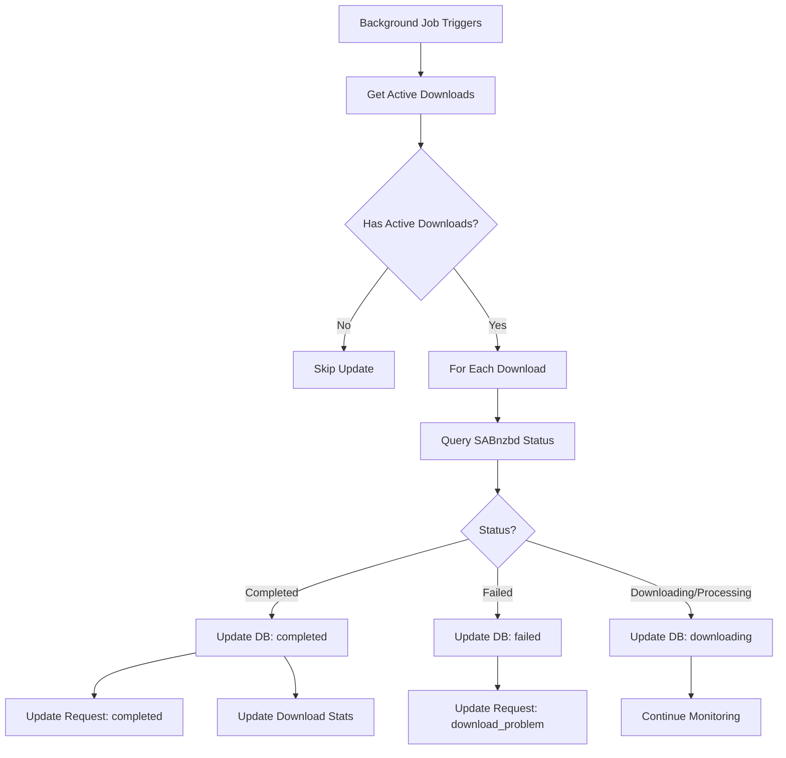

# SABnzbd Status Polling Implementation

## Overview

This document describes the SABnzbd status polling and download completion handling implementation for Bookrequestarr.

## Architecture

### Background Job

The status polling runs as a background job in `src/hooks.server.ts`:

- **Frequency**: Every 30 seconds
- **Startup delay**: 10 seconds (to allow server initialization)
- **Function**: `updateSabnzbdDownloadStatuses()` from `src/lib/server/downloadOrchestrator.ts`

### Status Update Flow



## Implementation Details

### Core Function: `updateSabnzbdDownloadStatuses()`

**Location**: `src/lib/server/downloadOrchestrator.ts` (lines 1055-1153)

**What it does**:

1. Queries database for all downloads with `downloadSource = 'prowlarr'`
2. Filters to only `pending` or `downloading` status
3. For each active download:
   - Calls `sabnzbd.getDownloadStatus(nzoId)`
   - Updates download record based on status
   - Updates associated request status
   - Updates download stats on completion

**Status Mappings**:

| SABnzbd Status | Download Status | Request Status | Actions |
|----------------|-----------------|----------------|---------|
| `completed` | `completed` | `completed` | Store file path, size, timestamp; increment stats |
| `failed` | `failed` | `download_problem` | Store error message |
| `downloading` | `downloading` | `approved` | Continue monitoring |
| `processing` | `downloading` | `approved` | Continue monitoring (extracting, verifying, etc.) |
| `queued` | `downloading` | `approved` | Continue monitoring |
| `paused` | `downloading` | `approved` | Continue monitoring |

### Helper Function: `getActiveSabnzbdDownloads()`

**Location**: `src/lib/server/downloadOrchestrator.ts` (lines 1177-1210)

**Purpose**: Get all active SABnzbd downloads with book information for monitoring/admin dashboards

**Returns**:
```typescript
{
  downloadId: string;
  requestId: string;
  bookTitle: string;
  nzoId: string;
  nzbName: string;
  indexer: string;
  status: string;
  confidenceScore: number;
  createdAt: Date;
}[]
```

## API Endpoints

### POST /api/downloads/poll

**Purpose**: Manually trigger status polling (admin only)

**Authentication**: Required (admin role)

**Usage**:
```bash
curl -X POST http://localhost:5173/api/downloads/poll \
  -H "Cookie: session=YOUR_SESSION_TOKEN"
```

**Response**:
```json
{
  "success": true,
  "message": "SABnzbd status polling completed"
}
```

### GET /api/downloads/active

**Purpose**: Get all active SABnzbd downloads (admin only)

**Authentication**: Required (admin role)

**Usage**:
```bash
curl http://localhost:5173/api/downloads/active \
  -H "Cookie: session=YOUR_SESSION_TOKEN"
```

**Response**:
```json
{
  "downloads": [
    {
      "downloadId": "uuid-123",
      "requestId": "uuid-456",
      "bookTitle": "The Great Book",
      "nzoId": "SABnzbd_nzo_abc123",
      "nzbName": "Book.Title.2024.EPUB-GROUP",
      "indexer": "NZBGeek",
      "status": "downloading",
      "confidenceScore": 95,
      "createdAt": "2024-01-15T10:30:00Z"
    }
  ],
  "count": 1
}
```

## Error Handling

### Download Not Found in SABnzbd

If a download is not found in SABnzbd queue or history:
- Warning is logged
- Download status is NOT changed (may reappear later)
- Continues checking other downloads

### SABnzbd API Errors

If SABnzbd API call fails:
- Error is logged with download ID
- Download status is NOT changed
- Continues checking other downloads
- Next polling cycle will retry

### Database Errors

If database update fails:
- Error is logged
- Other downloads continue processing
- Next polling cycle will retry

## Testing

### Manual Testing

Use the test script:

```bash
npm run test:sabnzbd
```

This will:
1. Check SABnzbd configuration
2. Display current queue and history
3. Show active downloads from database
4. Run a status update cycle
5. Display results

### Integration Testing

1. Start SABnzbd and configure in Bookrequestarr
2. Approve a book request (triggers download via Prowlarr/SABnzbd)
3. Monitor logs: `tail -f logs/app.log` (if logging to file)
4. Check database: `npm run db:studio`
5. Verify status updates every 30 seconds

### Monitoring

Watch the logs for polling activity:

```bash
# Development
npm run dev

# Look for these log messages:
# - "Checking SABnzbd download statuses"
# - "Checking SABnzbd status for downloads"
# - "SABnzbd download completed"
# - "SABnzbd download failed"
```

## Performance Considerations

### Polling Frequency

- **30 seconds** is a good balance between responsiveness and API load
- Can be adjusted in `src/hooks.server.ts` if needed
- SABnzbd API is lightweight, so frequent polling is acceptable

### Database Queries

- Only queries downloads with `downloadSource = 'prowlarr'`
- Filters to `pending` or `downloading` status
- Uses indexed fields for efficient queries

### SABnzbd API Calls

- One API call per active download
- SABnzbd API is fast (typically < 100ms per call)
- Errors don't block other downloads

## Troubleshooting

### Polling Not Running

Check `src/hooks.server.ts` is loaded:
```bash
# Should see this in logs on startup:
# "Initial SABnzbd status check failed" or success message
```

### Status Not Updating

1. Check SABnzbd is running and accessible
2. Verify API key is correct
3. Check download has `sabnzbdNzoId` in database
4. Look for errors in logs
5. Try manual polling: `POST /api/downloads/poll`

### Downloads Stuck in "downloading"

1. Check SABnzbd queue/history directly
2. Verify NZO ID matches between database and SABnzbd
3. Check for SABnzbd errors (failed download, missing blocks, etc.)
4. Try manual retry via SABnzbd UI

### High CPU/Memory Usage

- Polling should use minimal resources
- If issues occur, increase polling interval in `src/hooks.server.ts`
- Check for database lock issues (SQLite limitation)

## Future Enhancements

Potential improvements:

1. **WebSocket Updates**: Push status updates to frontend in real-time
2. **Configurable Polling**: Allow admins to set polling frequency via settings
3. **Retry Logic**: Automatically retry failed downloads after X minutes
4. **Notifications**: Send notifications when downloads complete/fail
5. **Progress Tracking**: Store and display download progress percentage
6. **Bandwidth Monitoring**: Track download speeds and bandwidth usage

## Related Files

- `src/hooks.server.ts` - Background job setup
- `src/lib/server/downloadOrchestrator.ts` - Core polling logic
- `src/lib/server/sabnzbd.ts` - SABnzbd API client
- `src/routes/api/downloads/poll/+server.ts` - Manual polling endpoint
- `src/routes/api/downloads/active/+server.ts` - Active downloads endpoint
- `scripts/test-sabnzbd-polling.ts` - Test script
